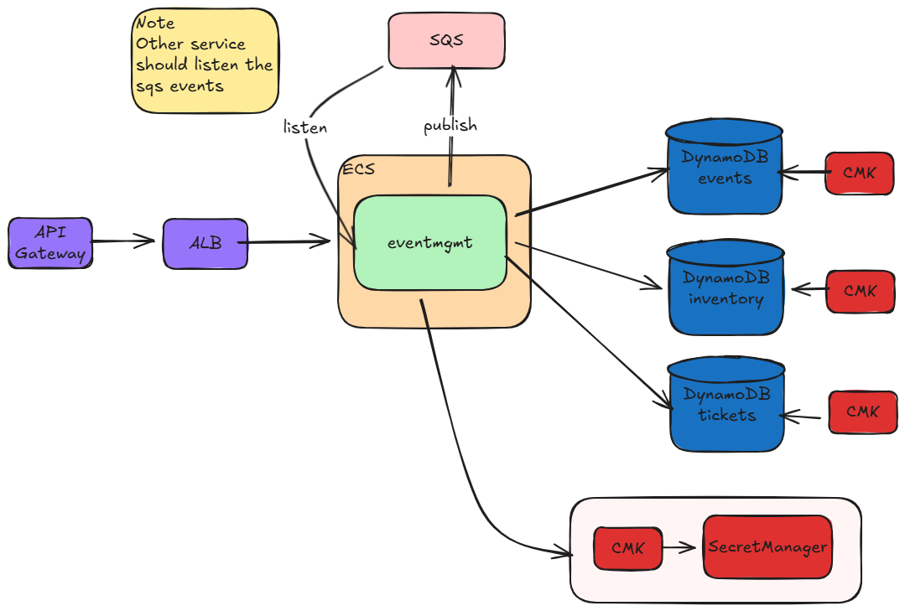

# EventMgmt

Event management and ticket purchasing microservice with concurrency control, asynchronous purchase processing, and
automatic release of expired reservations. Built with Clean/Hex architecture using Bancolombia’s scaffold and runnable
locally with LocalStack.

## Technologies

- Java 25
- Spring Boot 4
- Spring WebFlux (Router/Handler)
- Reactor (Mono/Flux)
- AWS SDK v2 (DynamoDB, SQS)
- Docker, Docker Compose, LocalStack
- Spring Boot Actuator, SpringDoc OpenAPI
- Testing: JUnit 5, Mockito, Reactor Test, ArchUnit, Jacoco, Pitest

## Features

- Create event
- Get events by place (using DynamoDB Query with GSI)
- Get real-time availability by event
- Place order (reserve tickets)
- Get order status
- Asynchronous purchase processing via SQS consumer
- Automatic release of expired reservations via scheduler
- Concurrency control to prevent overselling

## Architecture



### Modules (Bancolombia Scaffold)

- domain-model: Business entities and domain rules
- domain-usecase: Use cases (application logic)
- infrastructure/entry-points
    - reactive-web (WebFlux Router and Handler)
    - sqs (SQS listener and consumer)
    - scheduler (scheduled jobs)
- infrastructure/driven-adapters
    - dynamodb (persistence)
    - sqs (publisher)
    - rest-consumer (optional, only if required)

## Core Flows


### Purchase Flow

1. Client calls the place order endpoint
2. Service reserves inventory using a DynamoDB conditional update
3. Service creates an order with status RESERVED and an expiration timestamp
4. Service publishes the orderId to SQS
5. SQS consumer processes the order asynchronously
6. If still valid, order transitions to SOLD or COMPLIMENTARY and inventory is finalized
7. Scheduler periodically releases expired reservations

### Order State Machine

- RESERVED
- PENDING_CONFIRMATION
- SOLD
- COMPLIMENTARY
- EXPIRED
  

## API Endpoints

Base path depends on your configuration. Examples below assume /api.

### Events

- POST /api/v1/event
- GET /api/v1/event
- GET /api/v1/event?place={place} (Query events by place using GSI)
- GET /api/v1/event/{eventId}/availability

### Orders

- POST /api/orders
- GET /api/orders/{orderId}

### Observability

- GET /actuator/health
- GET /actuator/prometheus
- Swagger UI
    - /swagger-ui.html or /swagger-ui/index.html
- OpenAPI
    - /v3/api-docs

TODO Add an endpoints table plus request/response examples.

Suggested location: docs/api.md

## DynamoDB Query Strategy

The service uses DynamoDB Query operations instead of Scan for better performance and cost efficiency:

- **Events by Place**: Uses a Global Secondary Index (GSI) with `place` as partition key
- **Avoids Scan operations**: Scan is not used as it's inefficient for large datasets and consumes more RCUs
- **Query benefits**: More predictable performance, lower cost, and better scalability

## Concurrency Control

This service prevents overselling using DynamoDB conditional writes:

- Reservation step updates inventory only if available >= qty
- Finalization step is idempotent and safely transitions order status
- The SQS consumer is designed with at-least-once semantics in mind (duplicate messages are handled)

## Local Setup

### Prerequisites

- Docker and Docker Compose
- Java 25 toolchain

### Environment Variables

Create a .env file at the repository root. Example:

```
ACTIVE_PROFILE=local

AWS_REGION=us-east-1
AWS_ENDPOINT=http://localstack:4566

DYNAMO_EVENTS_TABLE=events
DYNAMO_INVENTORY_TABLE=inventory
DYNAMO_ORDERS_TABLE=orders

SQS_QUEUE_URL=http://localstack:4566/000000000000/orders-queue
SQS_ENDPOINT=http://localstack:4566
```

### Run Locally with LocalStack

1. Clone the repository

```
git clone https://github.com/victor013001/event-mgmt.git
cd event-mgmt
```

2. Start services

```
docker-compose up --build
```

3. Access the application

- API: http://localhost:8080
- Swagger UI: http://localhost:8080/v3/swagger-ui.html

## Logging and Sensitive Data Masking

The project uses Logback with a Logstash encoder to output structured JSON logs and apply masking rules for sensitive
data.

- Config file: src/main/resources/logback.xml
- Masking strategy
    - Mask JSON paths such as Authorization, token, apiKey, secret, password

## Tests

Run unit tests

```
./gradlew clean test
```

Coverage report

```
./gradlew jacocoTestReport
```

Mutation tests

```
./gradlew pitest
```

## Author

**[Victor Manuel Osorio Garcia](https://www.linkedin.com/in/victor013001)** - [GitHub](https://github.com/victor013001)
